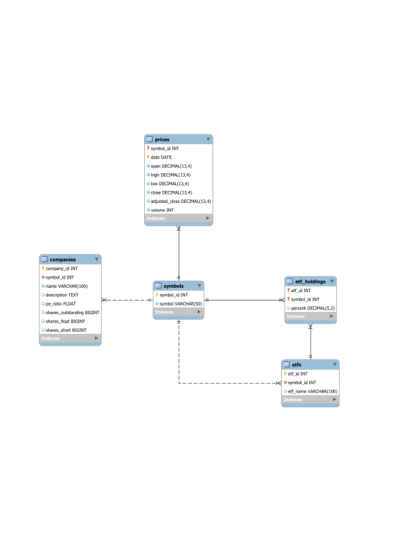

# Stockfetcher
This application was developed for CS 543 - Advanced Databases. It's main functionality is downloading, visualizing, and making predictions on stock data. Data on stock prices, related companies, and ETFs is stored in a local database.

## Downloading and Running
This project is built using gradle, so to download and run all you need to do is clone the repository and use the provided gradle wrapper (or your local install) to build:

```
git clone git@github.com:caleb98/stockfetcher.git
cd stockfetcher
./gradlew run
```

Note that for the program to function correctly, you must either setup your local database using the expected settings, or modify the code with the proper settings for connecting to your database. More information on database setup can be found in the [Database Creation](#Database-Creation) section below.

## Database Design


Price data is tracked in the price table, which associates Date-Symbol pairs with price information for that symbol on that date. Additional information about companies is stored in the companies table, which is associated with the symbols table using a symbol id. Similarly, ETF data is stored in the etfs table which is associated with the symbols table using a symbol id. Holding information for each ETF is stored in the etf_holdings table, where etf ids are linked to symbol ids.

### Database Creation
Database creation is done programmatically, and by default attempts to connect to a local database running Mysql using the user "stockfetcher" and password "stockfetcher". For this program to run properly, you must configure your local database setup in this way as well, or modify the database connection info in the [StockDatabase class](app/src/main/java/stockfetcher/db/StockDatabase.java).

### API Keys for Company Info
Company info is downloaded using the AlphaVantage API free tier. Normally, these api keys should be omitted from the repository and loaded from a file or obtained using environment variables. However, since this project is developed for a university course, these API keys are included in the repository for ease of use. The rate limit for API calls is 5 requests/min and 500 requests/day. A secondary API key is provided in the [StockApi class](app/src/main/java/stockfetcher/api/StockApi.java) and may be substituted if rate limits are hit using the default. However, for optimal use I suggest simply obtaining your own free API key from the [AlphaVantage website](https://www.alphavantage.co/).

### Other Data Sources
Stock price data is pulled from Yahoo finance as a CSV file which is directly parsed and inserted into the database. ETF overviews (name and relevant holdings, if available) are pulled from [Marketwatch](https://www.marketwatch.com/).

