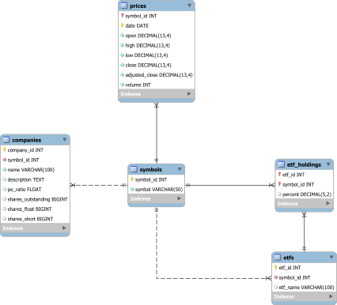

# Stockfetcher
This application was developed for CS 543 - Advanced Databases. It's main functionality is downloading, visualizing, and making predictions on stock data. Data on stock prices, related companies, and ETFs is stored in a local database.

## Downloading and Running
This project is built using gradle, so to download and run all you need to do is clone the repository and use the provided gradle wrapper (or your local install) to build:

```
git clone git@github.com:caleb98/stockfetcher.git
cd stockfetcher
./gradlew run
```

Note that for the program to function correctly, you must either setup your local database using the expected settings, or modify the code with the proper settings for connecting to your database. More information on database setup can be found in the [Database Creation](#Database-Creation) section below.

## Database Design


Price data is tracked in the price table, which associates Date-Symbol pairs with price information for that symbol on that date. Additional information about companies is stored in the companies table, which is associated with the symbols table using a symbol id. Similarly, ETF data is stored in the etfs table which is associated with the symbols table using a symbol id. Holding information for each ETF is stored in the etf_holdings table, where etf ids are linked to symbol ids.

### Database Creation
Database creation is done programmatically, and by default attempts to connect to a local database running Mysql using the user "stockfetcher" and password "stockfetcher". For this program to run properly, you must configure your local database setup in this way as well, or modify the database connection info in the [StockDatabase class](app/src/main/java/stockfetcher/db/StockDatabase.java).

### API Keys for Company Info
Company info is downloaded using the AlphaVantage API free tier. Normally, these api keys should be omitted from the repository and loaded from a file or obtained using environment variables. However, since this project is developed for a university course, these API keys are included in the repository for ease of use. The rate limit for API calls is 5 requests/min and 500 requests/day. A secondary API key is provided in the [StockApi class](app/src/main/java/stockfetcher/api/StockApi.java) and may be substituted if rate limits are hit using the default. However, for optimal use I suggest simply obtaining your own free API key from the [AlphaVantage website](https://www.alphavantage.co/).

### Other Data Sources
Stock price data is pulled from Yahoo finance as a CSV file which is directly parsed and inserted into the database. ETF overviews (name and relevant holdings, if available) are pulled from [Marketwatch](https://www.marketwatch.com/).

## Application Features
### Price Charts
Charts for stock prices may be created using data previously downloaded and stored in the database. To chart a given symbol, you may right click the symbol from the charts list on the left hand side of the window and select "Add to Current Chart" or "Add to New Chart". The active chart may be edited by clicking the "Edit Chart" button at the bottom of the central view area.


To select a specific range of dates for which you would like to chart the data, you may use the two date pickers at the bottom of the central view area below the chart. The "Reset Dates" button may be used to remove this date range and view all the present data for the charted symbol(s). The name of a chart may be changed using the "Edit Chart" button, or by double-clicking the chart's tab.

New charts can be opened using the "Add to New Chart" option when right clicking a symbol, or by using clicking the new tab button (labelled with a "+") in the tab list. Tabs may be closed by clicking the "X" button on the tab, or using the mouse middle click.

### Company/ETF Info
Company information and ETF holding information is displayed on the right hand side of the application window. The data presented will be automatically updated when selecting a new symbol from the symbols list. If company data is not present or is out of date, the data may be refreshed using the "Refresh Company Data" button at the bottom of the info panel.


Note that ETF info holding data may not include all stock symbols included in an ETF. This data is pulled only as available from MarketWatch.

## Downloading New Symbol Data
New symbols may be added to the database by selecting `Edit > Add Symbol` in the application menu bar. This will present you with a dialog box where you can provide a comma-separated list of new symbols that you would like to download data for. Symbols downloaded this way will automatically retrieve all available historical data.

## Updating Existing Data
Existing stock price data may be updated by selecting `Edit > Manual Update` in the application menu bar. This will present you with a dialog box where you can select the symbols you would like to update and the amount of data you would like to update for them. The "Full" option will redownload all historical data for the stock to the current day, while the "Recent" option will download the 100 most recent days of data (note that this includes weekdays, so the number of individual data points downloaded this way will be less than 100).


## Price Prediction
Predictions for a given stock price may be generated by right clicking the stock symbol in the symbols list on the left side of the window and selecting "Predict". You will be prompted with a dialog box to enter the range of dates you would like to use for the prediction data. Predictions will always be extended 100 days past the current day, even if the date interval ends earlier. 


Predictions are generated using a linear least squares approach. The orange line in the middle represents this best-fit line generated using data from the requested interval. The green lines represent this best-fit line plus and minus one standard deviation, while the blue lines represent plus and minus two standard deviations.

## Dark Mode
Dark mode may be toggled by selecting `Help > Dark Mode` from the application menu bar. Note that dark mode only applies the the main application window (not dialogs) and is not optimized for visibility in all conditions.

## Quick-Action
The quick action toolbar may be accessed by clicking the text entry field above the chart area or by using the hotkey `Ctrl + Shift + P`. Once active, you may begin typing to access various application features without needing to manually click through menus. The arrow keys or the tab key may be used to select different available actions. Pressing enter will execute the currently selected action. A list of possible actions are given below.

### Search
Allows searching existing symbols stored in the database. If the symbol is found, it is selected and the relevant Company/ETF information is displayed. If the symbol is not found, a prompt will appear asking if you would like to download the data for that symbol.

### Add New Symbol
Allows quick adding of a new stock symbol. Will automatically attempt to retrieve the full price history for the input text.

### Update Symbol
Allows quick updating of a stock symbol. This action will only be available for stock symbols which are already present in the database, and will retrieve recent stock data (past 100 days) only.

### Manual Update
Allows quick access to the manual stock update dialog, where you may select any number of symbols to update as well as how much data should be updated for those symbols.

### Add New Symbols
Allows quick access to the dialog for adding multiple new symbols.

### Predict Symbol
Allows quick access to the prediction dialog for the input symbol.